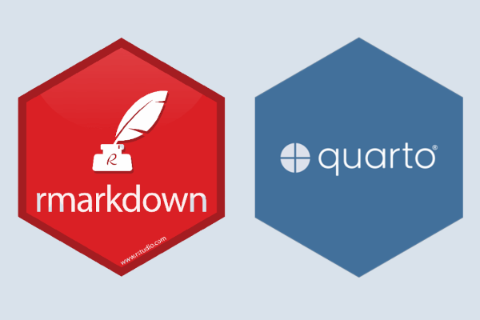
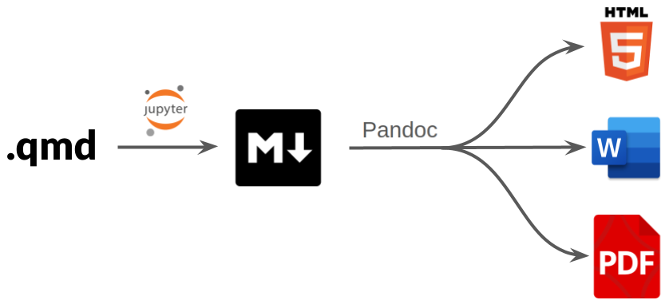
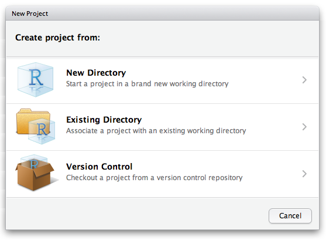

# RMarkdown e Quarto

## Perché usare un linguaggio di markup?

-   Riproducibilità: permette di documentare e replicare analisi scientifiche

-   Automazione: genera report, articoli e presentazioni senza copiare e incollare

-   Flessibilità: esportazione in HTML, PDF, Word, e altro

-   Collaborazione: facilita il lavoro di gruppo e la condivisione dei risultati

{fig-align="center"}

## Cos'è un linguaggio di markup?

-   Un sistema per strutturare e formattare testo con comandi testuali

-   Diverso da un word processor: il contenuto e la formattazione sono separati

-   Markdown è un esempio di linguaggio di markup semplice e leggibile

{fig-align="center"}

## Come funziona?

1.  Scrivi il codice: un file di testo con sezioni in Markdown e blocchi di codice R

2.  Esegui il codice: genera risultati direttamente nel documento

3.  Compila il documento: scegli il formato di output (HTML, PDF, Word, presentazioni...)

{fig-align="center"}

------------------------------------------------------------------------

## Quarto vs RMarkdown: differenze principali {.smaller}

| Caratteristica                | **Quarto**                                                | **RMarkdown**                                              |
|--------------------------|--------------------|--------------------------|
| **Dipendenza dal linguaggio** | Indipendente; funziona con R, Python, Julia, ObservableJS | Legato principalmente a **R** e al sistema **knitr**       |
| **Estensione dei file**       | `.qmd`                                                    | `.Rmd`                                                     |
| **Motore di rendering**       | Motore unificato Quarto (basato su Pandoc)                | `rmarkdown` + `knitr` + Pandoc                             |
| **Supporto multi-linguaggio** | Nativo e fluido (più linguaggi nello stesso documento)    | Principalmente R, supporto Python più limitato             |
| **Progetti e siti web**       | Supporto integrato per progetti, siti, libri, blog        | Richiede pacchetti diversi (bookdown, blogdown, xaringan…) |

## Quarto vs RMarkdown: differenze principali {.smaller}

| Caratteristica                  | **Quarto**                                                      | **RMarkdown**                                           |
|--------------------------|--------------------|--------------------------|
| **Cross-reference e citazioni** | Integrate e semplici da usare                                   | Spesso richiedono configurazioni o pacchetti aggiuntivi |
| **Formati di output**           | Sistema unificato (documenti, presentazioni, siti, libri)       | Diversi pacchetti per diversi formati                   |
| **Stile di configurazione**     | YAML più chiaro e coerente                                      | YAML più frammentato a seconda del formato              |
| **Prospettiva futura**          | Moderno, attivamente sviluppato, consigliato per nuovi progetti | Mantenuto per compatibilità, evoluzione più lenta       |

### In sintesi

**Quarto è l’evoluzione moderna e unificata di RMarkdown**, più potente, più flessibile e non legata solo al linguaggio R.

## Cosa faremo durante il corso?

-   Report dinamici con dati aggiornabili automaticamente

-   Presentazioni interattive con Reveal.js

-   Impostazione di un file per scrivere tesi e articoli in formato accademico (PDF, Word)

-   Esercitazione con presentazione finale

{fig-align="center"}

## 


# Github

## Cos'è Github

-   GitHub è un **sito web** dove teniamo i file dei nostri progetti.
-   Permette di:
    -   Salvare le **diverse versioni** dei file
    -   Tornare indietro se qualcosa si rompe
    -   **Condividere** e collaborare
    -   Tenere sincronizzato il lavoro tra computer diversi

> In questo corso useremo Github per gestire i file dei nostri progetti Quarto.

## Cos'è Git

-   **Git** è un **programma** che permette di gestire le versioni dei file.
-   Lo useremo dal **terminale** per collegare il nostro computer a GitHub.

Serve per:

-   Scaricare i file dal repository online
-   Salvare le modifiche ai file
-   Inviare le modifiche su GitHub
-   Aggiornare il progetto quando il docente cambia qualcosa

> Git è lo strumento che lavora dietro GitHub.

## Clonare la repository del corso

Per avere i file del corso sul proprio computer:

1.  Andare su **Github** nel browser
2.  Aprire la **repository del corso**
3.  Cliccare sul pulsante **`Code`**
4.  Copiare l'indirizzo della repository (URL)

Poi aprire il **terminale** e scrivere:

``` bash
git clone URL-della-repository
```

> Questo comando crea una copia della repository sul vostro computer.

## Il workflow principale (sempre lo stesso) {.smaller}

1.  Aprite il terminale nella cartella e controllate lo stato:

``` bash
git status
```

2.  Se siete sincronizzati con l'ultima versione su github iniziate con le vostre modifiche. Altrimenti prima di iniziare procedete con il seguente comando per scaricare l'ultima versione:

``` bash
git pull
```

3.  Quando avete finito di modificare la repository aggiungete i nuovi file:

``` bash
git add .
```

4.  Create un commit con un messaggio

``` bash
git commit -m "Aggiunta sezione risultati"
```

5.  Inviate le modifiche su github

``` bash
git push
```

## Creare la propria repository: {.smaller}

1.  Andare su Github (sito web)

2.  Cliccare su New repository

3.  Scegliere:

3.1. Nome del progetto (es. progetto-psicologia)

3.2. Una breve descrizione (opzionale)

4.  Scegliere la visibilità:

4.1 Public -\> chiunque può vedere il progetto

4.2 Private -\> lo vedete solo voi (o persone che invitate)

5.  Cliccare Create repository

**Poi:**

Per collegare una cartella locale alla repository potete fare come avete fatto per scaricare quella del corso:

``` bash
git clone URL-della-vostra-repository
```

## Impostazione di un progetto in RStudio

1.  Apri **RStudio** e vai su `File -> New Project`

2.  Scegli **New Directory** e poi \`Quarto Project\`\`

3.  Seleziona la cartella di destinazione e dai un nome al progetto

4.  Clicca su **Create Project**

{fig-align="center"}

# Struttura di un file Quarto (.qmd)

# 1. YAML

## YAML: opzioni principali

La testata **YAML** permette di definire:

::: {style="font-size: .8em;"}
-   `title`: titolo del documento\
-   `subtitle`: sottotitolo\
-   `author`: autore/i\
-   `date`: data\
-   `output`: formato di output\
-   `theme`: tema grafico\
-   `fontcolor`: colore del testo\
-   `fig-width`: larghezza predefinita delle figure\
-   `code-fold`: piegatura del codice (`true/false`)\
-   `toc`: indice dei contenuti (`true/false`)\
-   `number-sections`: numerazione sezioni
:::

## YAML: tipi di output

-   `html_document`
-   `pdf_document`
-   `word_document`
-   `revealjs`
-   `pptx`
-   `beamer`

È possibile specificare più output in un solo yaml così che il documento venga renderizzato contemporaneamente in più formati.

# 2. Corpo del documento

## Corpo del documento: Titoli e sottotitoli

\

\# Titolo principale

\## Sottotitolo di primo livello

\### Sottotitolo di secondo livello

\#### Sottotitolo di terzo livello

## Corpo del documento: Paragrafi e formattazione del testo

\

Questo è un \*\*paragrafo di esempio\*\* con testo in grassetto.

Si può anche usare \*corsivo\* o \`testo con font monospaziato\`.

\

Questo è un **paragrafo di esempio** con testo in grassetto.

Si può anche usare *corsivo* o `testo con font monospaziato`.

## Corpo del documento: Liste puntate e numerate

\

\- Elemento 1

\- Elemento 2

\- Elemento 3

\- Elemento 4

\

-   Elemento 1

-   Elemento 2

-   Elemento 3

-   Elemento 4

## 3. Blocchi di codice

Si usano per inserire codice ed eseguire analisi:

-   warning: se false, non fa vedere i warning del modello e/o funzione
-   include: nel repoprt o documento si vede oppure no l'ouput
-   eval: se true gira il codice, se false non gira proprio
-   echo: false -\> non si vede il codice, se echo -\> true si vede il codice che avete utilizzato

## 3. Blocchi di codice

\`\`\`r

#\| warning: false

#\| include: false

#\| eval: false

#\| echo: false

summary(cars)

\`\`\`

Per settare opzioni dei chunk in **Quarto**, in stile YAML, utilizzare #\| all'inizio di riga dentro il chunk.

## Inserire formule

-   Equazioni in una nuova riga: `$$…$$`
-   Equazione inline `$…$`

::: {style="text-align: center;"}
`$$ Y = \beta_{0} + \beta_{1} X $$`
:::

$$ Y = \beta_{0} + \beta_{1} X$$

{fig-align="center"}

## Esecuzione e rendering

1.  Per inserire i chunk `Ctrl + Alt + I` (Windows) `Cmd + Option + I` (Mac)
2.  Per eseguire i blocchi di codice, usa `Ctrl + Invio` (Windows) o `Cmd + Invio` (Mac)
3.  Per generare il documento finale, clicca su `Render` (Quarto) o `Knit` (R Markdown)

{fig-align="center"}

## Applicazioni pratiche

-   **Report dinamici** con dati aggiornabili automaticamente
-   **Presentazioni scientifiche** interattive con Reveal.js
-   **Scrittura di tesi e articoli** in formato accademico (PDF, Word, LaTeX)
-   **Dashboard e documentazione interattiva** per la ricerca

{fig-align="center"}

## Conclusione

-   R Markdown e Quarto semplificano la comunicazione scientifica
-   Strumenti potenti per creare documenti chiari, riproducibili e ben formattati
-   Indispensabili per una ricerca trasparente e collaborativa

{.absolute bottom="20" right="320" width="450" height="420"}
